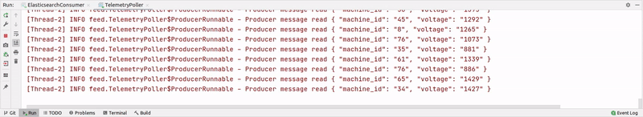
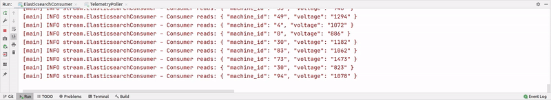

# Simulate IoT sensor, use Kafka to process data in real-time, save to Elasticsearch.

*Also published on [DEV](https://dev.to/musaatlihan/simulate-iot-sensor-use-kafka-to-process-data-in-real-time-save-to-elasticsearch-13c8)*

Previously I did a project that solves the predictive maintenance problem by using Apache Spark ML - with the article [here](https://dev.to/musaatlihan/predicting-machine-failures-with-distributed-computing-spark-aws-emr-and-dl-44b3).


Now I have done an additional project to collect that sensory data in real-time by using Apache Kafka.

First I created the [`TelemetryPoller`](https://github.com/musa-atlihan/IoT-voltage/blob/main/telemetry-feed/src/main/java/feed/TelemetryPoller.java) class - I need to simulate and produce random voltage readings. [`TelemetryRunnable`](https://github.com/musa-atlihan/IoT-voltage/blob/50e281986def45c88aeca6a9c216503c0d777af5/telemetry-feed/src/main/java/feed/TelemetryPoller.java#L103) subclass handles that part.

```java

private Long produceSensorReading() {
    Random random = new Random();
    long leftLimit = 800L;
    long rightLimit = 1500L;

    long number = leftLimit + (long) (Math.random() * (rightLimit - leftLimit));

    // simulate reading time
    try {
        Thread.sleep(random.nextInt(1000));
    } catch (InterruptedException e) {
        logger.info("SensorReading generation interrupted!");
    }
    return number;
}
```
Randomly generates a voltage value. I added some time delay to simulate a sensor `Thread.sleep(random.nextInt(1000))`.

Likewise, there is the [`produceMachineId`](https://github.com/musa-atlihan/IoT-voltage/blob/50e281986def45c88aeca6a9c216503c0d777af5/telemetry-feed/src/main/java/feed/TelemetryPoller.java#L124) method for producing random machine ids (there are 100 machines in the project).

Then I created the [`ProducerRunnable`](https://github.com/musa-atlihan/IoT-voltage/blob/50e281986def45c88aeca6a9c216503c0d777af5/telemetry-feed/src/main/java/feed/TelemetryPoller.java#L52) for another thread - the threadsafe `LinkedBlockingQueue` is shared across threads.

Kafka Producer Configs:

```shrinker_config
# Kafka Producer properties
topic=voltage-reading
bootstrap.servers=127.0.0.1:9092
key.serializer=org.apache.kafka.common.serialization.StringSerializer
value.serializer=org.apache.kafka.common.serialization.StringSerializer
# safe producer (Kafka >= 0.11)
enable.idempotence=true
acks=all
retries=2147483647
# if max.in.flight.requests.per.connection=5 Kafka >= 1.1 else 1
max.in.flight.requests.per.connection=5
# high throughput
compression.type=snappy
linger.ms=20
# (32*1024)
batch.size=32768
```

I created a topic with the name `voltage-reading`. I am using my local machine so the bootstrap server is `127.0.0.1:9092`.

I don't want Kafka to commit the same data multiple times so the `enable.idempotence` is `true`. `acks`, `retries` and `max.in.flight.requests.per.connection` are in default mode for the idempotent producer.

I am adding a small delay `linger.ms=20` and increase the `batch.size` so I can get high throughput which is good for a better message compression. Snappy is a good option for JSON compression.


Result is a stream of voltage values including the machine ids.



Now I need a Kafka Consumer and Elasticsearch Client.

I created them in the [`ElasticsearchConsumer`](https://github.com/musa-atlihan/IoT-voltage/blob/main/telemetry-stream/src/main/java/stream/ElasticsearchConsumer.java) class.

First I want to explain the settings a little bit:

```shrinker_config
# Kafka Consumer properties
topic=voltage-reading
bootstrap.servers=127.0.0.1:9092
key.deserializer=org.apache.kafka.common.serialization.StringDeserializer
value.deserializer=org.apache.kafka.common.serialization.StringDeserializer
group.id=voltage-reading-elasticsearch
auto.offset.reset=latest
enable.auto.commit=false
```

Again it is running on the localhost, thus the bootstrap server is `127.0.0.1:9092`. Kafka Consumers need a group id, or it will assign a random one. I am getting the `latest` messages and `enable.auto.commit` is false, because I will commit the batch manually. By doing the manual committing, I will ensure the `at least once` property, but I need to be careful about the document duplication in the Elasticsearch index. So, additionally I am generating a unique id by using Kafka records' topic name, partition number, and offset number.

```java
String id = record.topic() + "_" + record.partition() + '_' + record.offset();
```

I am giving this id to Elasticsearch client to prevent any duplication.

Finally, the while loop:

```java
while (true) {
    ConsumerRecords<String, String> records = consumer.poll(Duration.ofMillis(100));

    BulkRequest bulkRequest = new BulkRequest();

    for (ConsumerRecord<String, String> record : records) {
        // kafka generic id to prevent document duplication
        String id = record.topic() + "_" + record.partition() + '_' + record.offset();
        logger.info("Consumer reads: " + record.value());

        try {
            // insert data into elasticsearch
            IndexRequest indexRequest = new IndexRequest("machine-telemetry")
                    .id(id)
                    .source(record.value(), XContentType.JSON);

            bulkRequest.add(indexRequest);
        } catch (NullPointerException e) { // skip bad data
            logger.warn("Skipping bad data: " + record.value());
        }
    }

    if (records.count() > 0) {
        BulkResponse bulkItemResponses = client.bulk(bulkRequest, RequestOptions.DEFAULT);
        consumer.commitSync();
    }
}
```

I am using a `BulkRequest` for a better performance, so the client waits until it goes over each record in the for loop. After the `bulk` operation, it is time to manually commit the messages that are put into Elasticsearch - `consumer.commitSync()`.

And when `ElasticsearchConsumer` class is  running, I see the streaming data is being consumed and is in the Elasticsearch.



### Summary

In this project, I created a simulator to produce random voltage values as if they are being produced from an IoT sensor. Then I created a Kafka Producer to send that stream into Kafka (Brokers). Finally, I used Kafka Consumer to put that stream into Elasticsearch.

I made the Producer safe by making it idempotent (meaning no duplication on the Brokers). In addition, since I am producing and consuming JSON string data, I applied an efficient compression algorithm called Snappy. Because when the batch is larger the compression is more efficient, I put some delay and increased the batch size from 16KB to 32KB.

On the consumer side, I disabled the automatic committing to ensure `at least once` behaviour and did the committing manually after putting the messages into Elasticseach.


